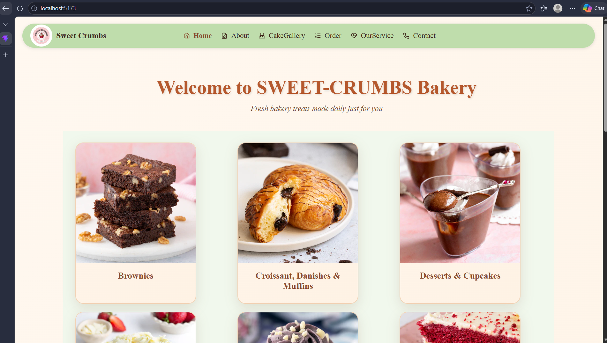
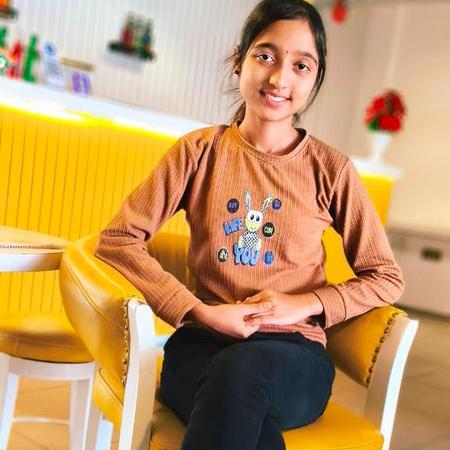

# 🍰 Sweet Crumbs Bakery Website

A simple and responsive bakery website built using React JS, HTML, CSS, and JavaScript.  
This project showcases a modern UI for a bakery with pages like Home, Menu, Gallery, Services, and Contact.

---

## 🚀 Features

- 🏠 Home page with slider & cards  
- 🎂 Cake Gallery with images & prices  
- 🛎️ Order page UI  
- 💡 Unique "Our Services" section  
- 📞 Contact section  
- 🧁 Attractive Footer with social icons  
- 📱 Fully responsive design  

---

## 🛠️ Tech Stack

- React JS  
- HTML  
- CSS  
- JavaScript  

---

## 📂 Project Structure

src/
├── assets/
├── components/
│ ├── Navbar/
│ ├── Footer/
│ ├── Cards/
├── pages/
│ ├── Home.jsx
│ ├── About.jsx
│ ├── Gallery.jsx
│ ├── Order.jsx
│ ├── OurService.jsx
│ ├── Contact.jsx
├── App.jsx
├── main.jsx

## 👩‍💻 Contributors

<table>
  <tr>
    <td align="center">
      
      <br />
      <sub><b>Rutuja</b></sub>
    </td>
    <td align="center">
      
      <br />
      <sub><b>Saee</b></sub>
    </td>
    <td align="center">
      
      <br />
      <sub><b>Namarata</b></sub>
    </td>
    <td align="center">
      
      <br />
      <sub><b>Purva</b></sub>
    </td>
     <td align="center">
      
      <br />
      <sub><b>Devki</b></sub>
    </td>
  </tr>
</table>

---

## 📦 Installation

```bash
git clone https://github.com/your-username/your-repo-name.git
cd your-repo-name
npm install
npm run dev